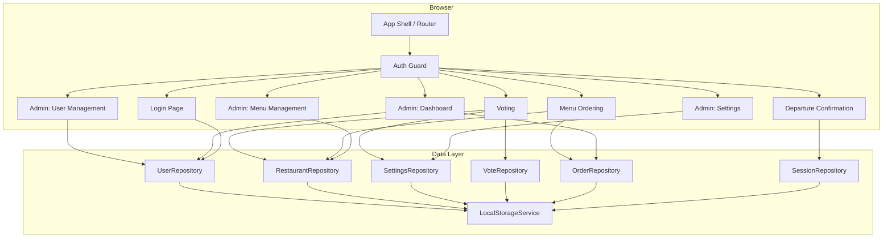
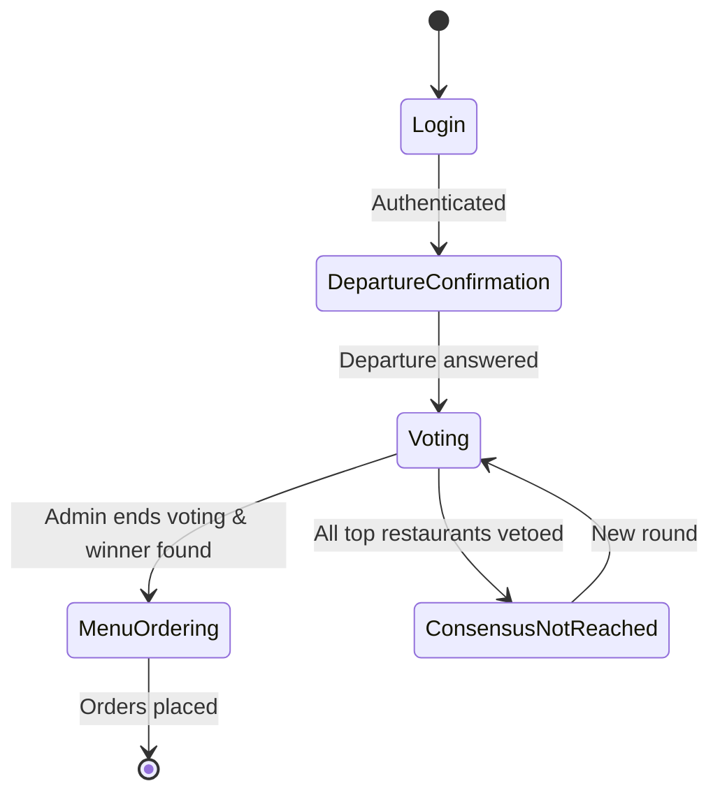

# Design Document: OfficeLunch Base

## Overview

OfficeLunch is a single-page Angular application that coordinates daily office lunch outings. It runs entirely in the browser with localStorage as its persistence layer. The architecture is designed around a clean separation between data access (repository services backed by a generic localStorage service) and UI (standalone Angular components using Signals and modern control flow). This makes it straightforward to swap localStorage for a real HTTP backend later.

The application is organized into six lazy-loaded feature areas: User Management, Menu Management, Settings, Departure Confirmation, Voting, and Menu Ordering. An auth guard protects all routes, and a role-based guard restricts admin-only areas.

## Architecture



### Routing Structure

```
/login                → LoginComponent (public)
/departure            → DepartureComponent (auth guard)
/voting               → VotingComponent (auth guard)
/ordering             → OrderingComponent (auth guard)
/admin/users          → UserManagementComponent (admin guard)
/admin/menu           → MenuManagementComponent (admin guard)
/admin/settings       → SettingsComponent (admin guard)
/admin/dashboard      → DashboardComponent (admin guard)
```

All feature routes are lazy-loaded. The auth guard redirects unauthenticated users to `/login`. The admin guard redirects non-admin users to `/departure`.

### Application Flow



## Components and Interfaces

### Core Services

**LocalStorageService** — Injectable, providedIn: 'root'
- `getItem<T>(key: string): T | null` — Parse and return JSON from localStorage
- `setItem<T>(key: string, value: T): void` — Serialize and store JSON to localStorage
- `removeItem(key: string): void` — Remove a key from localStorage
- `clear(): void` — Remove all OfficeLunch keys (prefixed with `ol_`)

All keys are prefixed with `ol_` to avoid collisions.

**AuthService** — Injectable, providedIn: 'root'
- `currentUser: Signal<User | null>` — The currently logged-in user
- `isAdmin: Signal<boolean>` — Computed from currentUser
- `login(username: string, password: string): boolean` — Validates credentials, sets currentUser
- `logout(): void` — Clears currentUser and navigates to login

### Repository Services

Each repository follows the same pattern: inject `LocalStorageService`, operate on a specific key.

**UserRepository** — key: `ol_users`
- `getAll(): User[]`
- `getById(id: string): User | null`
- `add(user: Omit<User, 'id'>): User`
- `update(user: User): void`
- `remove(id: string): void`
- `findByUsername(username: string): User | null`

**RestaurantRepository** — key: `ol_restaurants`
- `getAll(): Restaurant[]`
- `getEnabled(): Restaurant[]`
- `getById(id: string): Restaurant | null`
- `add(restaurant: Omit<Restaurant, 'id'>): Restaurant`
- `update(restaurant: Restaurant): void`
- `remove(id: string): void`

**SettingsRepository** — key: `ol_settings`
- `get(): Settings`
- `update(settings: Partial<Settings>): void`

**VoteRepository** — key: `ol_votes`
- `getCurrentRound(): VotingRound | null`
- `startRound(): VotingRound`
- `submitVote(userId: string, vote: Vote): void`
- `submitVeto(userId: string, restaurantId: string): void`
- `endRound(): VotingResult`
- `getLastChoices(count: number): string[]` — Returns last N winning restaurant IDs

**OrderRepository** — key: `ol_orders`
- `getByRound(roundId: string): Order[]`
- `submitOrder(order: Omit<Order, 'id'>): Order`
- `getAll(): Order[]`

**SessionRepository** — key: `ol_sessions`
- `getDepartureResponse(userId: string): DepartureResponse | null`
- `setDepartureResponse(userId: string, response: DepartureResponse): void`
- `getAllResponses(): DepartureResponse[]`

### Guards

**authGuard** — `CanActivateFn` that checks `AuthService.currentUser()` is not null
**adminGuard** — `CanActivateFn` that checks `AuthService.isAdmin()` is true

### Shared Components (in `shared/` directory)

Reusable UI primitives used across all feature areas. All use standalone components, SCSS for styling, and a minimalistic visual design (clean borders, neutral palette, generous whitespace).

| Component | Purpose | Inputs / Outputs |
|---|---|---|
| `AppButtonComponent` | Standard button | `@Input label`, `@Input variant: 'primary' \| 'secondary' \| 'danger'`, `@Input disabled`, `@Output clicked` |
| `AppInputComponent` | Text / password input | `@Input label`, `@Input type`, `@Input placeholder`, two-way binding via `ngModel` or `formControl` |
| `AppCardComponent` | Content card wrapper | Content projection via `<ng-content>`, `@Input title` |
| `AppBadgeComponent` | Status badge | `@Input text`, `@Input color: 'green' \| 'red' \| 'gray'` |
| `AppModalComponent` | Confirmation / form dialog | `@Input open`, `@Input title`, `@Output closed`, content projection |
| `AppTableComponent` | Simple data table | `@Input columns`, `@Input rows`, `@Output rowAction` |

### Styling Approach

- All components use SCSS (`.scss` file extension in `styleUrls`)
- Minimalistic look: flat design, subtle borders (`1px solid #e0e0e0`), neutral color palette
- Shared SCSS variables in `styles/_variables.scss` (colors, spacing, border-radius, font sizes)
- Shared SCSS mixins in `styles/_mixins.scss` (button styles, card styles, input styles)
- Global styles in `styles.scss` import variables and set base typography / reset
- No CSS framework — hand-rolled minimal styles for full control

### Feature Components

Each feature area has a primary component:

| Component | Feature | Key Signals |
|---|---|---|
| LoginComponent | Auth | `username`, `password`, `errorMessage` |
| DepartureComponent | Departure | `departureTime`, `canLeave`, `alternativeTime` |
| VotingComponent | Voting | `restaurants`, `votes`, `lastChoices`, `roundActive`, `result` |
| OrderingComponent | Ordering | `winningRestaurant`, `dishes`, `selectedDish`, `orderSubmitted` |
| UserManagementComponent | Admin | `users`, `editingUser` |
| MenuManagementComponent | Admin | `restaurants`, `editingRestaurant` |
| SettingsComponent | Admin | `settings` |
| DashboardComponent | Admin | `orders`, `departureResponses` |

## Data Models

```typescript
interface User {
  id: string;
  username: string;
  password: string;
  isAdmin: boolean;
  isDisabled: boolean;
}

interface Restaurant {
  id: string;
  name: string;
  dishes: Dish[];
  isDisabled: boolean;
}

interface Dish {
  id: string;
  name: string;
  price?: number;
}

interface Settings {
  lastChoicesCount: number;       // default: 5
  calendarEventName: string;      // default: ''
  departureTime: string;          // HH:mm format, default: '12:00'
}

interface VotingRound {
  id: string;
  isActive: boolean;
  votes: VoteEntry[];
  vetoes: VetoEntry[];
  winnerId: string | null;
  createdAt: string;              // ISO date
}

interface VoteEntry {
  userId: string;
  allocations: { restaurantId: string; points: number }[];  // exactly 3 entries: 3, 2, 1
}

interface VetoEntry {
  userId: string;
  restaurantId: string;
}

interface VotingResult {
  winnerId: string | null;
  consensusReached: boolean;
  vetoUsers: string[];            // usernames who blocked consensus
}

interface Order {
  id: string;
  roundId: string;
  userId: string;
  restaurantId: string;
  dishId: string;
  createdAt: string;
}

interface DepartureResponse {
  userId: string;
  canLeave: boolean;
  alternativeTime?: string;       // HH:mm format
}
```

### ID Generation

IDs are generated using `crypto.randomUUID()` which is available in all modern browsers.

### localStorage Key Map

| Key | Type | Description |
|---|---|---|
| `ol_users` | `User[]` | All user accounts |
| `ol_restaurants` | `Restaurant[]` | All restaurants with dishes |
| `ol_settings` | `Settings` | Application settings |
| `ol_votes` | `VotingRound[]` | All voting rounds |
| `ol_orders` | `Order[]` | All menu orders |
| `ol_sessions` | `DepartureResponse[]` | Departure responses for current day |
| `ol_current_user` | `string` | Currently logged-in user ID |


## Correctness Properties

*A property is a characteristic or behavior that should hold true across all valid executions of a system — essentially, a formal statement about what the system should do. Properties serve as the bridge between human-readable specifications and machine-verifiable correctness guarantees.*

### Property 1: Login succeeds if and only if credentials match a non-disabled user

*For any* username and password pair, `AuthService.login(username, password)` should return `true` if and only if there exists a user in the repository with that username, that password, and `isDisabled === false`.

**Validates: Requirements 1.2, 1.3, 2.3**

### Property 2: User CRUD round-trip

*For any* valid user data (username, isAdmin, isDisabled), adding a user through `UserRepository.add()` and then retrieving it by ID should return a user with the same data and a password of `"lunch"`. Updating that user and reading again should return the updated data. Removing the user and reading again should return `null`.

**Validates: Requirements 2.1, 2.2, 2.4**

### Property 3: Restaurant enable/disable filtering

*For any* set of restaurants where some are disabled and some are enabled, `RestaurantRepository.getEnabled()` should return exactly the restaurants where `isDisabled === false`. Furthermore, disabling an enabled restaurant should remove it from `getEnabled()`, and enabling a disabled restaurant should add it back.

**Validates: Requirements 3.1, 3.3, 3.4**

### Property 4: Dish management round-trip

*For any* restaurant and any dish data, adding a dish to the restaurant and then retrieving the restaurant should include that dish in its `dishes` array with the same name and price.

**Validates: Requirements 3.2**

### Property 5: Settings round-trip

*For any* valid settings values (lastChoicesCount as positive integer, calendarEventName as string, departureTime as HH:mm string), updating settings through `SettingsRepository.update()` and then reading via `SettingsRepository.get()` should return the updated values.

**Validates: Requirements 4.2, 4.3, 4.4**

### Property 6: Departure response round-trip

*For any* user ID and departure response (canLeave boolean, optional alternativeTime string), storing the response via `SessionRepository.setDepartureResponse()` and reading it back via `SessionRepository.getDepartureResponse()` should return an equivalent response.

**Validates: Requirements 5.2, 5.4**

### Property 7: Vote allocation validation

*For any* vote submission, the vote should be accepted if and only if it contains exactly three allocations with point values that are a permutation of [3, 2, 1] assigned to three distinct restaurant IDs that are all enabled.

**Validates: Requirements 6.2**

### Property 8: Veto recording round-trip

*For any* user and any enabled restaurant, casting a veto and then inspecting the current round's vetoes should include an entry matching that user and restaurant.

**Validates: Requirements 6.3**

### Property 9: Voting algorithm correctness

*For any* set of valid votes and vetoes, ending the round should select the restaurant with the highest total points among those with zero vetoes. If every restaurant that has the maximum points also has at least one veto, the result should have `consensusReached === false` and `vetoUsers` should contain the usernames of users whose vetoes blocked the top-scoring restaurants.

**Validates: Requirements 6.4, 6.5**

### Property 10: Last choices retrieval

*For any* sequence of completed voting rounds with winners and any positive integer N, `VoteRepository.getLastChoices(N)` should return the last min(N, total) winning restaurant IDs in reverse chronological order.

**Validates: Requirements 6.6**

### Property 11: Vote immutability during active round

*For any* user who has already submitted a vote in the current active round, attempting to submit another vote should be rejected and the original vote should remain unchanged.

**Validates: Requirements 6.7**

### Property 12: Order round-trip

*For any* user, round, restaurant, and dish, submitting an order and then querying orders by round should include an order matching that user and dish.

**Validates: Requirements 7.2**

### Property 13: Order requirement based on departure status

*For any* user, ordering is required (must be enforced) if and only if that user's departure response has `canLeave === false`. Users with `canLeave === true` may order but are not required to.

**Validates: Requirements 7.3, 7.4**

### Property 14: LocalStorage service round-trip

*For any* JSON-serializable value and any key string, calling `LocalStorageService.setItem(key, value)` followed by `LocalStorageService.getItem(key)` should return a value deeply equal to the original. Calling `removeItem(key)` followed by `getItem(key)` should return `null`.

**Validates: Requirements 8.1**

## Error Handling

| Scenario | Handling |
|---|---|
| Invalid login credentials | Display inline error message, do not reveal whether username or password is wrong |
| Disabled user login attempt | Display same error as invalid credentials (no information leakage) |
| Vote with invalid point allocation | Reject submission, display validation error listing the required format |
| Vote on disabled restaurant | Exclude disabled restaurants from the voting UI; reject if submitted programmatically |
| Duplicate vote in same round | Reject with message "You have already voted in this round" |
| Order submission without active winner | Reject with message, ordering screen should not be accessible without a winner |
| localStorage full | Catch QuotaExceededError, display user-friendly message suggesting clearing browser data |
| Corrupted localStorage data | If JSON parsing fails, log error and return default/empty state for that key |
| Missing settings | Fall back to defaults: lastChoicesCount=5, calendarEventName='', departureTime='12:00' |
| `window.__initDb()` called in production | No restriction — it's a developer tool, always available on window |

## Testing Strategy

### Testing Framework

- **Unit & Integration Tests**: Jasmine + Karma (Angular CLI default) or Jest
- **Property-Based Tests**: [fast-check](https://github.com/dubzzz/fast-check) — the standard PBT library for TypeScript/JavaScript
- **Minimum iterations**: 100 per property test

### Unit Tests

Unit tests cover specific examples, edge cases, and error conditions:

- Login with default admin/admin credentials (Req 1.1)
- Auth guard redirects unauthenticated users (Req 1.4)
- Admin guard redirects non-admin users (Req 3.6)
- Settings defaults when no data exists (Req 4.1, 4.6)
- Testing helper seeds correct data counts (Req 9.1–9.5)
- Departure screen shows correct time from settings (Req 5.5)
- Corrupted localStorage graceful handling
- QuotaExceededError handling

### Property-Based Tests

Each correctness property maps to a single property-based test using fast-check:

| Test | Property | Tag |
|---|---|---|
| Login correctness | Property 1 | Feature: office-lunch-base, Property 1: Login succeeds iff credentials match non-disabled user |
| User CRUD round-trip | Property 2 | Feature: office-lunch-base, Property 2: User CRUD round-trip |
| Restaurant filtering | Property 3 | Feature: office-lunch-base, Property 3: Restaurant enable/disable filtering |
| Dish round-trip | Property 4 | Feature: office-lunch-base, Property 4: Dish management round-trip |
| Settings round-trip | Property 5 | Feature: office-lunch-base, Property 5: Settings round-trip |
| Departure response round-trip | Property 6 | Feature: office-lunch-base, Property 6: Departure response round-trip |
| Vote validation | Property 7 | Feature: office-lunch-base, Property 7: Vote allocation validation |
| Veto recording | Property 8 | Feature: office-lunch-base, Property 8: Veto recording round-trip |
| Voting algorithm | Property 9 | Feature: office-lunch-base, Property 9: Voting algorithm correctness |
| Last choices | Property 10 | Feature: office-lunch-base, Property 10: Last choices retrieval |
| Vote immutability | Property 11 | Feature: office-lunch-base, Property 11: Vote immutability |
| Order round-trip | Property 12 | Feature: office-lunch-base, Property 12: Order round-trip |
| Order requirement | Property 13 | Feature: office-lunch-base, Property 13: Order requirement based on departure |
| localStorage round-trip | Property 14 | Feature: office-lunch-base, Property 14: LocalStorage service round-trip |

### Test Organization

```
base/src/
├── styles/
│   ├── _variables.scss                      ← Shared SCSS variables
│   └── _mixins.scss                         ← Shared SCSS mixins
├── styles.scss                              ← Global styles (imports variables, reset)
└── app/
    ├── shared/
    │   ├── components/
    │   │   ├── button/app-button.component.ts + .scss + .spec.ts
    │   │   ├── input/app-input.component.ts + .scss + .spec.ts
    │   │   ├── card/app-card.component.ts + .scss + .spec.ts
    │   │   ├── badge/app-badge.component.ts + .scss + .spec.ts
    │   │   ├── modal/app-modal.component.ts + .scss + .spec.ts
    │   │   └── table/app-table.component.ts + .scss + .spec.ts
    │   └── index.ts                         ← Public API barrel
    ├── services/
    │   ├── local-storage.service.spec.ts    ← Unit + Property 14
    │   ├── auth.service.spec.ts             ← Unit + Property 1
    │   └── repositories/
    │       ├── user.repository.spec.ts      ← Unit + Properties 2
    │       ├── restaurant.repository.spec.ts← Unit + Properties 3, 4
    │       ├── settings.repository.spec.ts  ← Unit + Property 5
    │       ├── vote.repository.spec.ts      ← Unit + Properties 7, 8, 9, 10, 11
    │       ├── order.repository.spec.ts     ← Unit + Property 12
    │       └── session.repository.spec.ts   ← Unit + Properties 6, 13
    └── features/
        └── (component tests for UI behavior)
```
