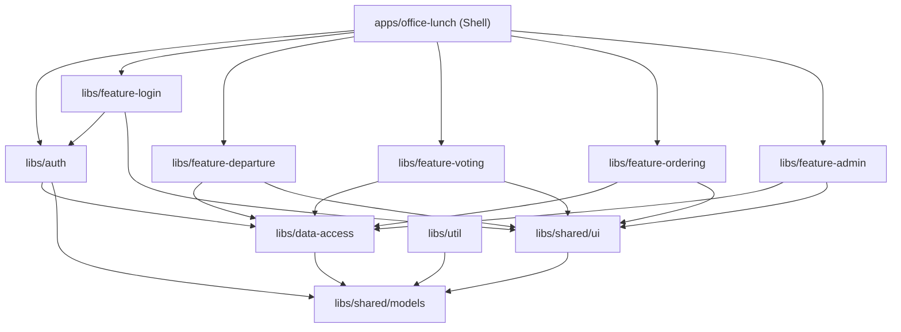

# Design Document: office-lunch-nx

## Overview

This document describes the technical design for migrating the `office-lunch` Angular 21 application from the `base/` folder into an Nx monorepo at `nx/`. The migration is a structural reorganisation — no business logic changes. All source files are copied from `base/src/` into the appropriate Nx project, import paths are updated to use workspace path aliases, and Nx tooling configuration is added.

The result is a workspace where:
- `nx/apps/office-lunch/` is the shell Angular application (bootstrapper + routing)
- `nx/libs/` contains independently buildable and testable libraries grouped by concern

---

## Architecture

### Monorepo Layout

```
nx/
├── apps/
│   └── office-lunch/           # Shell app (bootstrapper + routing)
│       ├── src/
│       │   ├── app/
│       │   │   ├── app.config.ts
│       │   │   ├── app.routes.ts
│       │   │   ├── app.ts
│       │   │   ├── app.html
│       │   │   └── app.scss
│       │   ├── index.html
│       │   ├── main.ts
│       │   ├── styles.scss
│       │   └── test-setup.ts
│       ├── project.json
│       ├── tsconfig.app.json
│       ├── tsconfig.spec.json
│       └── vitest.config.ts
│
├── libs/
│   ├── shared/
│   │   ├── ui/                 # Reusable UI components
│   │   │   ├── src/lib/
│   │   │   │   ├── button/
│   │   │   │   ├── input/
│   │   │   │   ├── card/
│   │   │   │   ├── badge/
│   │   │   │   ├── modal/
│   │   │   │   └── table/
│   │   │   ├── index.ts        # Barrel file
│   │   │   ├── project.json
│   │   │   └── vitest.config.ts
│   │   └── models/             # TypeScript interfaces
│   │       ├── src/lib/
│   │       ├── index.ts
│   │       └── project.json
│   │
│   ├── data-access/            # Repositories + LocalStorageService
│   │   ├── src/lib/
│   │   │   ├── local-storage.service.ts
│   │   │   └── repositories/
│   │   ├── index.ts
│   │   ├── project.json
│   │   └── vitest.config.ts
│   │
│   ├── auth/                   # AuthService + guards
│   │   ├── src/lib/
│   │   │   ├── auth.service.ts
│   │   │   ├── auth.guard.ts
│   │   │   └── admin.guard.ts
│   │   ├── index.ts
│   │   ├── project.json
│   │   └── vitest.config.ts
│   │
│   ├── util/                   # Helper functions (initDb)
│   │   ├── src/lib/
│   │   │   └── init-db.ts
│   │   ├── index.ts
│   │   └── project.json
│   │
│   ├── feature-login/
│   │   ├── src/lib/login/
│   │   ├── index.ts
│   │   ├── project.json
│   │   └── vitest.config.ts
│   │
│   ├── feature-departure/
│   │   ├── src/lib/departure/
│   │   ├── index.ts
│   │   ├── project.json
│   │   └── vitest.config.ts
│   │
│   ├── feature-voting/
│   │   ├── src/lib/voting/
│   │   ├── index.ts
│   │   ├── project.json
│   │   └── vitest.config.ts
│   │
│   ├── feature-ordering/
│   │   ├── src/lib/ordering/
│   │   ├── index.ts
│   │   ├── project.json
│   │   └── vitest.config.ts
│   │
│   └── feature-admin/
│       ├── src/lib/
│       │   ├── dashboard/
│       │   ├── menu-management/
│       │   ├── settings/
│       │   └── user-management/
│       ├── index.ts
│       ├── project.json
│       └── vitest.config.ts
│
├── package.json
├── nx.json
├── tsconfig.base.json
└── eslint.config.js
```

### Dependency Graph



**Boundary rules (enforced via ESLint `@nx/enforce-module-boundaries`):**
- `shared/models` — no dependencies on any other workspace library
- `shared/ui` — may only depend on `shared/models`
- `data-access` — may only depend on `shared/models`
- `auth` — may only depend on `data-access` and `shared/models`
- `util` — may only depend on `shared/models`
- `feature-*` — may depend on `data-access`, `auth`, `shared/ui`, `shared/models`, `util`; must NOT depend on other `feature-*` libs
- `apps/office-lunch` — may depend on any library

---

## Components and Interfaces

### Shell App (`apps/office-lunch`)

The shell app is a thin bootstrapper. It contains:
- `main.ts` — bootstraps the Angular application using `appConfig`
- `app.config.ts` — provides `provideRouter(routes)` and `provideBrowserGlobalErrorListeners()`
- `app.routes.ts` — defines all top-level routes with lazy-loaded feature components
- `app.ts` / `app.html` / `app.scss` — root component with `<router-outlet>`

Route lazy-loading uses path aliases:

```typescript
// app.routes.ts (shell)
{
  path: 'login',
  loadComponent: () =>
    import('@office-lunch/feature-login').then(m => m.LoginComponent),
},
{
  path: 'departure',
  canActivate: [authGuard],
  loadComponent: () =>
    import('@office-lunch/feature-departure').then(m => m.DepartureComponent),
},
// ... etc
```

### Library Public APIs (Barrel Files)

Each library exposes its public API through `index.ts` at the library root:

| Library | Path Alias | Exported Symbols |
|---|---|---|
| `shared/models` | `@office-lunch/shared/models` | All model interfaces |
| `shared/ui` | `@office-lunch/shared/ui` | 6 shared components + types |
| `data-access` | `@office-lunch/data-access` | `LocalStorageService`, 6 repositories |
| `auth` | `@office-lunch/auth` | `AuthService`, `authGuard`, `adminGuard` |
| `util` | `@office-lunch/util` | `initDb` |
| `feature-login` | `@office-lunch/feature-login` | `LoginComponent` |
| `feature-departure` | `@office-lunch/feature-departure` | `DepartureComponent` |
| `feature-voting` | `@office-lunch/feature-voting` | `VotingComponent` |
| `feature-ordering` | `@office-lunch/feature-ordering` | `OrderingComponent` |
| `feature-admin` | `@office-lunch/feature-admin` | `DashboardComponent`, `MenuManagementComponent`, `SettingsComponent`, `UserManagementComponent` |

---

## Data Models

All data models are migrated verbatim from `base/src/app/models/` into `libs/shared/models/src/lib/`. No model changes are made.

```
libs/shared/models/src/lib/
├── user.model.ts          → User
├── restaurant.model.ts    → Restaurant, Dish
├── order.model.ts         → Order
├── voting.model.ts        → VotingRound, VoteEntry, VetoEntry, VotingResult
├── departure.model.ts     → DepartureResponse
└── settings.model.ts      → Settings
```

The barrel file re-exports all of these:

```typescript
// libs/shared/models/index.ts
export * from './src/lib/user.model';
export * from './src/lib/restaurant.model';
export * from './src/lib/order.model';
export * from './src/lib/voting.model';
export * from './src/lib/departure.model';
export * from './src/lib/settings.model';
```

---

## Nx Configuration

### `nx.json`

```json
{
  "$schema": "./node_modules/nx/schemas/nx-schema.json",
  "defaultProject": "office-lunch",
  "targetDefaults": {
    "build": { "dependsOn": ["^build"] },
    "test": { "dependsOn": ["^build"] },
    "lint": {}
  }
}
```

### `tsconfig.base.json`

Defines all path aliases:

```json
{
  "compileOnSave": false,
  "compilerOptions": {
    "rootDir": ".",
    "sourceMap": true,
    "declaration": false,
    "moduleResolution": "bundler",
    "emitDecoratorMetadata": true,
    "experimentalDecorators": true,
    "importHelpers": true,
    "target": "ES2022",
    "module": "preserve",
    "strict": true,
    "noImplicitOverride": true,
    "noPropertyAccessFromIndexSignature": true,
    "noImplicitReturns": true,
    "noFallthroughCasesInSwitch": true,
    "skipLibCheck": true,
    "isolatedModules": true,
    "paths": {
      "@office-lunch/shared/models": ["libs/shared/models/index.ts"],
      "@office-lunch/shared/ui": ["libs/shared/ui/index.ts"],
      "@office-lunch/data-access": ["libs/data-access/index.ts"],
      "@office-lunch/auth": ["libs/auth/index.ts"],
      "@office-lunch/util": ["libs/util/index.ts"],
      "@office-lunch/feature-login": ["libs/feature-login/index.ts"],
      "@office-lunch/feature-departure": ["libs/feature-departure/index.ts"],
      "@office-lunch/feature-voting": ["libs/feature-voting/index.ts"],
      "@office-lunch/feature-ordering": ["libs/feature-ordering/index.ts"],
      "@office-lunch/feature-admin": ["libs/feature-admin/index.ts"]
    }
  }
}
```

### `project.json` structure (per library)

Each library has a `project.json` following this pattern:

```json
{
  "name": "feature-login",
  "projectType": "library",
  "sourceRoot": "libs/feature-login/src",
  "targets": {
    "lint": {
      "executor": "@nx/eslint:lint",
      "options": { "lintFilePatterns": ["libs/feature-login/**/*.ts"] }
    },
    "test": {
      "executor": "nx:run-commands",
      "options": {
        "command": "vitest --run --config libs/feature-login/vitest.config.ts"
      }
    }
  }
}
```

The shell app's `project.json` additionally includes a `build` target using `@angular/build:application` and a `serve` target using `@angular/build:dev-server`.

### ESLint Boundary Rules

```javascript
// eslint.config.js (root)
{
  rules: {
    '@nx/enforce-module-boundaries': ['error', {
      enforceBuildableLibDependency: true,
      allow: [],
      depConstraints: [
        { sourceTag: 'scope:shared', onlyDependOnLibsWithTags: [] },
        { sourceTag: 'scope:data-access', onlyDependOnLibsWithTags: ['scope:shared'] },
        { sourceTag: 'scope:auth', onlyDependOnLibsWithTags: ['scope:shared', 'scope:data-access'] },
        { sourceTag: 'scope:util', onlyDependOnLibsWithTags: ['scope:shared'] },
        { sourceTag: 'scope:feature', onlyDependOnLibsWithTags: ['scope:shared', 'scope:data-access', 'scope:auth', 'scope:util'] },
        { sourceTag: 'scope:app', onlyDependOnLibsWithTags: ['scope:shared', 'scope:data-access', 'scope:auth', 'scope:util', 'scope:feature'] },
      ]
    }]
  }
}
```

Each library's `project.json` is tagged with the appropriate `scope:*` tag.

### Vitest Configuration

Each library and the shell app has a `vitest.config.ts` that reuses the `angularInlineResources` plugin from the base app:

```typescript
// libs/feature-login/vitest.config.ts
import { defineConfig } from 'vitest/config';
import { angularInlineResources } from '../../vitest-utils/angular-inline-resources';

export default defineConfig({
  plugins: [angularInlineResources()],
  test: {
    globals: true,
    environment: 'jsdom',
    include: ['src/**/*.spec.ts'],
    setupFiles: ['src/test-setup.ts'],
  },
});
```

The `angularInlineResources` plugin is extracted into a shared utility at `nx/vitest-utils/angular-inline-resources.ts` so all projects can import it without duplication.

---

## Import Path Migration

Every file copied from `base/src/` has its relative cross-boundary imports rewritten to use path aliases. Within-library relative imports remain unchanged.

### Migration mapping

| Original relative import | New path alias |
|---|---|
| `../../models/user.model` | `@office-lunch/shared/models` |
| `../../models/restaurant.model` | `@office-lunch/shared/models` |
| `../services/auth.service` | `@office-lunch/auth` |
| `../guards/auth.guard` | `@office-lunch/auth` |
| `../guards/admin.guard` | `@office-lunch/auth` |
| `../services/local-storage.service` | `@office-lunch/data-access` |
| `../services/repositories/user.repository` | `@office-lunch/data-access` |
| `../shared` (shared components) | `@office-lunch/shared/ui` |

Within-library imports (e.g., a component importing its own service in the same feature lib) keep relative paths.

---

## Error Handling

- **Circular dependency errors**: Prevented by the ESLint boundary rules and the strict one-way dependency graph. If a circular import is introduced, the lint target will fail with a clear error message.
- **Missing path alias**: If a path alias is misconfigured in `tsconfig.base.json`, TypeScript will emit a "Cannot find module" error at compile time, surfacing the issue immediately.
- **Build failures**: The shell app's `build` target depends on all library builds (`"dependsOn": ["^build"]`), so any library compilation error will surface during the app build.
- **Test isolation**: Each library's `vitest.config.ts` scopes `include` to its own `src/**/*.spec.ts`, preventing test bleed between projects.

---

## Testing Strategy

### Dual Testing Approach

Both unit tests and property-based tests are used:
- **Unit tests**: Verify specific examples, edge cases, and error conditions for services and repositories.
- **Property tests**: Verify universal correctness properties using `fast-check` (already a dev dependency in the base app).

### Unit Testing

All existing `.spec.ts` files from `base/src/` are migrated verbatim into their corresponding library. No test assertions are changed. Tests run via Vitest with the `jsdom` environment.

Existing test files:
- `libs/shared/ui/src/lib/button/app-button.component.spec.ts`
- `libs/shared/ui/src/lib/card/app-card.component.spec.ts`
- `libs/shared/ui/src/lib/input/app-input.component.spec.ts`
- `libs/shared/ui/src/lib/modal/app-modal.component.spec.ts`
- `libs/shared/ui/src/lib/table/app-table.component.spec.ts`
- `libs/data-access/src/lib/local-storage.service.spec.ts`
- `libs/data-access/src/lib/repositories/order.repository.spec.ts`
- `libs/data-access/src/lib/repositories/restaurant.repository.spec.ts`
- `libs/data-access/src/lib/repositories/session.repository.spec.ts`
- `libs/data-access/src/lib/repositories/settings.repository.spec.ts`
- `libs/data-access/src/lib/repositories/user.repository.spec.ts`
- `libs/data-access/src/lib/repositories/vote.repository.spec.ts`
- `libs/auth/src/lib/auth.service.spec.ts`
- `libs/util/src/lib/init-db.spec.ts`
- `apps/office-lunch/src/app/app.spec.ts`

### Property-Based Testing

Property tests use `fast-check` and are co-located with their implementation files as `.spec.ts` files. Each property test runs a minimum of 100 iterations.

Tag format: `// Feature: office-lunch-nx, Property N: <property_text>`

### Test Runner

Each project's Nx `test` target runs:
```
vitest --run --config <project>/vitest.config.ts
```

A root-level `vitest.workspace.ts` references all project configs for running all tests at once.


---

## Correctness Properties

*A property is a characteristic or behavior that should hold true across all valid executions of a system — essentially, a formal statement about what the system should do. Properties serve as the bridge between human-readable specifications and machine-verifiable correctness guarantees.*

This migration is primarily a structural transformation. Most acceptance criteria are verified by example (checking specific files exist with specific content). However, several criteria express universal rules that hold across all files or all libraries in the workspace — these are expressed as properties.

After prework analysis and property reflection, the following non-redundant properties were identified:

---

Property 1: No cross-boundary relative imports
*For any* TypeScript file in the `nx/` workspace, the file SHALL NOT contain a relative import path that traverses outside its own library boundary (i.e., no `../../libs/`, `../../../libs/`, or similar patterns that cross into another library's source tree).
**Validates: Requirements 13.2, 13.3**

---

Property 2: All base source files have a migrated equivalent
*For any* `.ts`, `.html`, `.scss`, or `.spec.ts` file present in `base/src/`, there SHALL exist a corresponding file in the `nx/` workspace at the expected mapped path.
**Validates: Requirements 13.1, 13.4**

---

Property 3: Data-access library imports models only from the shared/models alias
*For any* TypeScript file in `nx/libs/data-access/src/`, every import of a model type SHALL use the `@office-lunch/shared/models` path alias, not a relative path pointing to a model file.
**Validates: Requirements 5.3**

---

Property 4: Every library has a vitest config with jsdom environment
*For any* library directory under `nx/libs/` and for the shell app at `nx/apps/office-lunch/`, there SHALL exist a `vitest.config.ts` file whose `test.environment` is set to `'jsdom'`.
**Validates: Requirements 15.2**

