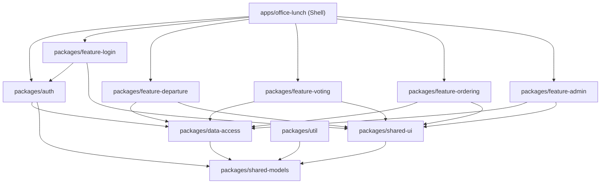

# Design Document: office-lunch-turborepo

## Overview

This document describes the technical design for migrating the `office-lunch` Angular 21 application from the `base/` folder into a Turborepo monorepo at `turborepo/`. The migration is a structural reorganisation — no business logic changes. All source files are copied from `base/src/` into the appropriate Turborepo package, import paths are updated to use workspace path aliases, and Turborepo tooling configuration is added.

The result is a workspace where:
- `turborepo/apps/office-lunch/` is the shell Angular application (bootstrapper + routing)
- `turborepo/packages/` contains independently testable packages grouped by concern

Turborepo differs from Nx in that it is a task runner and caching layer only — it does not generate code or enforce module boundaries via plugins. Boundary enforcement is handled by ESLint rules, and package structure follows npm workspaces conventions.

---

## Architecture

### Monorepo Layout

```
turborepo/
├── apps/
│   └── office-lunch/               # Shell app (bootstrapper + routing)
│       ├── src/
│       │   ├── app/
│       │   │   ├── app.config.ts
│       │   │   ├── app.routes.ts
│       │   │   ├── app.ts
│       │   │   ├── app.html
│       │   │   └── app.scss
│       │   ├── index.html
│       │   ├── main.ts
│       │   ├── styles.scss
│       │   └── test-setup.ts
│       ├── angular.json
│       ├── package.json
│       ├── tsconfig.app.json
│       ├── tsconfig.spec.json
│       └── vitest.config.ts
│
├── packages/
│   ├── shared-models/              # TypeScript interfaces
│   │   ├── src/lib/
│   │   │   ├── user.model.ts
│   │   │   ├── restaurant.model.ts
│   │   │   ├── order.model.ts
│   │   │   ├── voting.model.ts
│   │   │   ├── departure.model.ts
│   │   │   └── settings.model.ts
│   │   ├── index.ts
│   │   ├── package.json
│   │   └── vitest.config.ts
│   │
│   ├── shared-ui/                  # Reusable UI components
│   │   ├── src/lib/
│   │   │   ├── button/
│   │   │   ├── input/
│   │   │   ├── card/
│   │   │   ├── badge/
│   │   │   ├── modal/
│   │   │   └── table/
│   │   ├── src/styles/
│   │   │   ├── _variables.scss
│   │   │   └── _mixins.scss
│   │   ├── index.ts
│   │   ├── package.json
│   │   └── vitest.config.ts
│   │
│   ├── data-access/                # Repositories + LocalStorageService
│   │   ├── src/lib/
│   │   │   ├── local-storage.service.ts
│   │   │   ├── local-storage.service.spec.ts
│   │   │   └── repositories/
│   │   ├── index.ts
│   │   ├── package.json
│   │   └── vitest.config.ts
│   │
│   ├── auth/                       # AuthService + guards
│   │   ├── src/lib/
│   │   │   ├── auth.service.ts
│   │   │   ├── auth.service.spec.ts
│   │   │   ├── auth.guard.ts
│   │   │   └── admin.guard.ts
│   │   ├── index.ts
│   │   ├── package.json
│   │   └── vitest.config.ts
│   │
│   ├── util/                       # Helper functions (initDb)
│   │   ├── src/lib/
│   │   │   ├── init-db.ts
│   │   │   └── init-db.spec.ts
│   │   ├── index.ts
│   │   ├── package.json
│   │   └── vitest.config.ts
│   │
│   ├── feature-login/
│   │   ├── src/lib/login/
│   │   ├── index.ts
│   │   ├── package.json
│   │   └── vitest.config.ts
│   │
│   ├── feature-departure/
│   │   ├── src/lib/departure/
│   │   ├── index.ts
│   │   ├── package.json
│   │   └── vitest.config.ts
│   │
│   ├── feature-voting/
│   │   ├── src/lib/voting/
│   │   ├── index.ts
│   │   ├── package.json
│   │   └── vitest.config.ts
│   │
│   ├── feature-ordering/
│   │   ├── src/lib/ordering/
│   │   ├── index.ts
│   │   ├── package.json
│   │   └── vitest.config.ts
│   │
│   └── feature-admin/
│       ├── src/lib/
│       │   ├── dashboard/
│       │   ├── menu-management/
│       │   ├── settings/
│       │   └── user-management/
│       ├── index.ts
│       ├── package.json
│       └── vitest.config.ts
│
├── vitest-utils/
│   └── angular-inline-resources.ts # Shared Vite plugin
│
├── vitest.workspace.ts             # Root workspace test config
├── package.json                    # Root workspace package.json
├── turbo.json                      # Turborepo pipeline config
├── tsconfig.json                   # Root tsconfig with path aliases
└── eslint.config.js                # Root ESLint config
```

### Dependency Graph



**Boundary rules (enforced via ESLint):**
- `shared-models` — no dependencies on any other workspace package
- `shared-ui` — may only depend on `shared-models`
- `data-access` — may only depend on `shared-models`
- `auth` — may only depend on `data-access` and `shared-models`
- `util` — may only depend on `shared-models`
- `feature-*` — may depend on `data-access`, `auth`, `shared-ui`, `shared-models`, `util`; must NOT depend on other `feature-*` packages
- `apps/office-lunch` — may depend on any package

---

## Components and Interfaces

### Shell App (`apps/office-lunch`)

The shell app is a thin bootstrapper. It contains:
- `main.ts` — bootstraps the Angular application using `appConfig`
- `app.config.ts` — provides `provideRouter(routes)` and `provideBrowserGlobalErrorListeners()`
- `app.routes.ts` — defines all top-level routes with lazy-loaded feature components
- `app.ts` / `app.html` / `app.scss` — root component with `<router-outlet>`

Route lazy-loading uses path aliases:

```typescript
// app.routes.ts (shell)
{
  path: 'login',
  loadComponent: () =>
    import('@office-lunch/feature-login').then(m => m.LoginComponent),
},
{
  path: 'departure',
  canActivate: [authGuard],
  loadComponent: () =>
    import('@office-lunch/feature-departure').then(m => m.DepartureComponent),
},
// ... etc
```

### Package Public APIs (Barrel Files)

Each package exposes its public API through `index.ts` at the package root:

| Package | Path Alias | Exported Symbols |
|---|---|---|
| `shared-models` | `@office-lunch/shared-models` | All model interfaces |
| `shared-ui` | `@office-lunch/shared-ui` | 6 shared components + types |
| `data-access` | `@office-lunch/data-access` | `LocalStorageService`, 6 repositories |
| `auth` | `@office-lunch/auth` | `AuthService`, `authGuard`, `adminGuard` |
| `util` | `@office-lunch/util` | `initDb` |
| `feature-login` | `@office-lunch/feature-login` | `LoginComponent` |
| `feature-departure` | `@office-lunch/feature-departure` | `DepartureComponent` |
| `feature-voting` | `@office-lunch/feature-voting` | `VotingComponent` |
| `feature-ordering` | `@office-lunch/feature-ordering` | `OrderingComponent` |
| `feature-admin` | `@office-lunch/feature-admin` | `DashboardComponent`, `MenuManagementComponent`, `SettingsComponent`, `UserManagementComponent` |

---

## Data Models

All data models are migrated verbatim from `base/src/app/models/` into `packages/shared-models/src/lib/`. No model changes are made.

```
packages/shared-models/src/lib/
├── user.model.ts          → User
├── restaurant.model.ts    → Restaurant, Dish
├── order.model.ts         → Order
├── voting.model.ts        → VotingRound, VoteEntry, VetoEntry, VotingResult
├── departure.model.ts     → DepartureResponse
└── settings.model.ts      → Settings
```

The barrel file re-exports all of these:

```typescript
// packages/shared-models/index.ts
export * from './src/lib/user.model';
export * from './src/lib/restaurant.model';
export * from './src/lib/order.model';
export * from './src/lib/voting.model';
export * from './src/lib/departure.model';
export * from './src/lib/settings.model';
```

---

## Turborepo Configuration

### `turbo.json`

```json
{
  "$schema": "https://turbo.build/schema.json",
  "tasks": {
    "build": {
      "dependsOn": ["^build"],
      "outputs": ["dist/**"]
    },
    "test": {
      "dependsOn": ["^build"],
      "outputs": []
    },
    "lint": {
      "outputs": []
    },
    "dev": {
      "dependsOn": ["^build"],
      "persistent": true,
      "cache": false
    }
  }
}
```

Key design decisions:
- `build` depends on `^build` (caret = upstream packages must build first)
- `test` depends on `^build` so all dependencies are compiled before tests run
- `lint` has no upstream dependencies — runs in parallel across all packages
- `dev` is marked `persistent: true` so Turborepo knows it is a long-running process
- `dev` has `cache: false` because the dev server output is not cacheable

### Root `package.json`

```json
{
  "name": "office-lunch-turborepo",
  "private": true,
  "workspaces": ["apps/*", "packages/*"],
  "scripts": {
    "build": "turbo build",
    "test": "turbo test",
    "lint": "turbo lint",
    "dev": "turbo dev --filter=office-lunch"
  },
  "devDependencies": {
    "turbo": "latest"
  }
}
```

### Root `tsconfig.json`

Defines all path aliases. Each package's `tsconfig.json` extends this root config:

```json
{
  "compileOnSave": false,
  "compilerOptions": {
    "rootDir": ".",
    "sourceMap": true,
    "declaration": false,
    "moduleResolution": "bundler",
    "emitDecoratorMetadata": true,
    "experimentalDecorators": true,
    "importHelpers": true,
    "target": "ES2022",
    "module": "preserve",
    "strict": true,
    "noImplicitOverride": true,
    "noPropertyAccessFromIndexSignature": true,
    "noImplicitReturns": true,
    "noFallthroughCasesInSwitch": true,
    "skipLibCheck": true,
    "isolatedModules": true,
    "paths": {
      "@office-lunch/shared-models": ["packages/shared-models/index.ts"],
      "@office-lunch/shared-ui": ["packages/shared-ui/index.ts"],
      "@office-lunch/data-access": ["packages/data-access/index.ts"],
      "@office-lunch/auth": ["packages/auth/index.ts"],
      "@office-lunch/util": ["packages/util/index.ts"],
      "@office-lunch/feature-login": ["packages/feature-login/index.ts"],
      "@office-lunch/feature-departure": ["packages/feature-departure/index.ts"],
      "@office-lunch/feature-voting": ["packages/feature-voting/index.ts"],
      "@office-lunch/feature-ordering": ["packages/feature-ordering/index.ts"],
      "@office-lunch/feature-admin": ["packages/feature-admin/index.ts"]
    }
  }
}
```

### Per-Package `package.json`

Each package has its own `package.json` that declares its name (matching the path alias) and scripts:

```json
{
  "name": "@office-lunch/feature-login",
  "version": "0.0.0",
  "private": true,
  "scripts": {
    "build": "tsc --noEmit",
    "test": "vitest --run --config vitest.config.ts",
    "lint": "eslint src --ext .ts,.html"
  }
}
```

The shell app's `package.json` additionally includes Angular CLI dependencies and a `dev` script:

```json
{
  "name": "office-lunch",
  "scripts": {
    "build": "ng build",
    "dev": "ng serve",
    "test": "vitest --run --config vitest.config.ts",
    "lint": "eslint src --ext .ts,.html"
  }
}
```

### ESLint Boundary Rules

Since Turborepo does not provide built-in boundary enforcement, ESLint rules are used at the root level:

```javascript
// eslint.config.js (root)
export default [
  {
    rules: {
      'no-restricted-imports': ['error', {
        patterns: [
          { group: ['../../*', '../../../*'], message: 'Use path aliases instead of relative cross-package imports.' }
        ]
      }]
    }
  }
];
```

### Vitest Configuration

The `angularInlineResources` plugin is extracted into a shared utility at `turborepo/vitest-utils/angular-inline-resources.ts` so all packages can import it without duplication.

Each package has a `vitest.config.ts`:

```typescript
// packages/feature-login/vitest.config.ts
import { defineConfig } from 'vitest/config';
import { angularInlineResources } from '../../vitest-utils/angular-inline-resources';

export default defineConfig({
  plugins: [angularInlineResources()],
  test: {
    globals: true,
    environment: 'jsdom',
    include: ['src/**/*.spec.ts'],
    setupFiles: ['src/test-setup.ts'],
  },
});
```

The root `vitest.workspace.ts` references all configs:

```typescript
// vitest.workspace.ts
export default [
  'apps/office-lunch/vitest.config.ts',
  'packages/shared-models/vitest.config.ts',
  'packages/shared-ui/vitest.config.ts',
  'packages/data-access/vitest.config.ts',
  'packages/auth/vitest.config.ts',
  'packages/util/vitest.config.ts',
  'packages/feature-login/vitest.config.ts',
  'packages/feature-departure/vitest.config.ts',
  'packages/feature-voting/vitest.config.ts',
  'packages/feature-ordering/vitest.config.ts',
  'packages/feature-admin/vitest.config.ts',
];
```

---

## Import Path Migration

Every file copied from `base/src/` has its relative cross-boundary imports rewritten to use path aliases. Within-package relative imports remain unchanged.

### Migration mapping

| Original relative import | New path alias |
|---|---|
| `../../models/user.model` | `@office-lunch/shared-models` |
| `../../models/restaurant.model` | `@office-lunch/shared-models` |
| `../services/auth.service` | `@office-lunch/auth` |
| `../guards/auth.guard` | `@office-lunch/auth` |
| `../guards/admin.guard` | `@office-lunch/auth` |
| `../services/local-storage.service` | `@office-lunch/data-access` |
| `../services/repositories/user.repository` | `@office-lunch/data-access` |
| `../shared` (shared components) | `@office-lunch/shared-ui` |

Within-package imports (e.g., a component importing its own service in the same feature package) keep relative paths.

---

## Error Handling

- **Circular dependency errors**: Prevented by the one-way dependency graph. If a circular import is introduced, TypeScript will emit a compilation error.
- **Missing path alias**: If a path alias is misconfigured in `tsconfig.json`, TypeScript will emit a "Cannot find module" error at compile time.
- **Build failures**: Because `build` depends on `^build` in `turbo.json`, any upstream package compilation error will surface before the downstream consumer attempts to build.
- **Test isolation**: Each package's `vitest.config.ts` scopes `include` to its own `src/**/*.spec.ts`, preventing test bleed between packages.
- **Cache invalidation**: Turborepo hashes all inputs to each task. If a package's source changes, its cache entry is invalidated and the task re-runs.

---

## Testing Strategy

### Dual Testing Approach

Both unit tests and property-based tests are used:
- **Unit tests**: Verify specific examples, edge cases, and error conditions for services and repositories.
- **Property tests**: Verify universal correctness properties using `fast-check` (already a dev dependency in the base app).

### Unit Testing

All existing `.spec.ts` files from `base/src/` are migrated verbatim into their corresponding package. No test assertions are changed. Tests run via Vitest with the `jsdom` environment.

### Property-Based Testing

Property tests use `fast-check` and are co-located with their implementation files as `.spec.ts` files. Each property test runs a minimum of 100 iterations.

Tag format: `// Feature: office-lunch-turborepo, Property N: <property_text>`

### Test Runner

Each package's `test` script runs:
```
vitest --run --config vitest.config.ts
```

Running `turbo test` from the workspace root runs all packages' test scripts in dependency order with caching.

---

## Correctness Properties

*A property is a characteristic or behavior that should hold true across all valid executions of a system — essentially, a formal statement about what the system should do. Properties serve as the bridge between human-readable specifications and machine-verifiable correctness guarantees.*

After prework analysis and property reflection, the following non-redundant properties were identified:

---

Property 1: No cross-boundary relative imports
*For any* TypeScript file in the `turborepo/` workspace, the file SHALL NOT contain a relative import path that traverses outside its own package boundary (i.e., no `../../packages/`, `../../../packages/`, or similar patterns that cross into another package's source tree).
**Validates: Requirements 13.2, 13.3**

---

Property 2: All base source files have a migrated equivalent
*For any* `.ts`, `.html`, `.scss`, or `.spec.ts` file present in `base/src/`, there SHALL exist a corresponding file in the `turborepo/` workspace at the expected mapped path.
**Validates: Requirements 13.1, 13.4**

---

Property 3: Data-access package imports models only from the shared-models alias
*For any* TypeScript file in `turborepo/packages/data-access/src/`, every import of a model type SHALL use the `@office-lunch/shared-models` path alias, not a relative path pointing to a model file.
**Validates: Requirements 5.3**

---

Property 4: Every package has a vitest config with jsdom environment
*For any* package directory under `turborepo/packages/` and for the shell app at `turborepo/apps/office-lunch/`, there SHALL exist a `vitest.config.ts` file whose `test.environment` is set to `'jsdom'`.
**Validates: Requirements 15.2**

---

Property 5: Every package has a path alias in root tsconfig.json
*For any* package directory under `turborepo/packages/`, there SHALL exist a corresponding entry in the root `tsconfig.json` `paths` object mapping `@office-lunch/<package-name>` to that package's `index.ts`.
**Validates: Requirements 1.3**

---

Property 6: vitest.workspace.ts references all package vitest configs
*For any* package directory under `turborepo/packages/` and for the shell app, the root `vitest.workspace.ts` SHALL contain a reference to that package's `vitest.config.ts`.
**Validates: Requirements 15.1**
